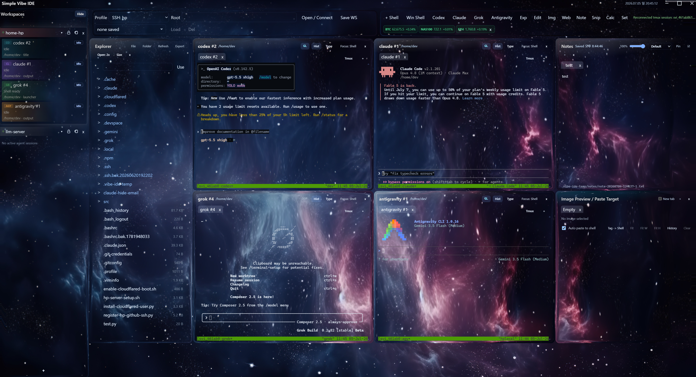
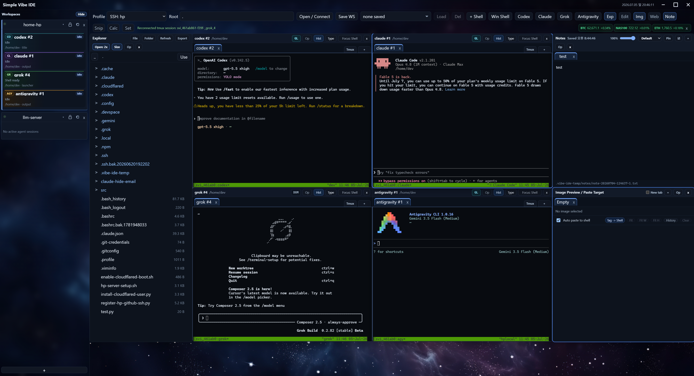

# Simple Vibe IDE

<p>
  <a href="#korean-version">한국어</a> ·
  <a href="#english-version">English</a> ·
  <a href="docs/USER_GUIDE.ko.md">User Guide (KO)</a> ·
  <a href="docs/LLM_INSTALL_GUIDE.md">LLM / Agent Build Guide</a>
</p>

Simple Vibe IDE is a Windows-first Tauri v2 desktop app for fast LLM coding sessions across Windows, WSL, and SSH workspaces. It is a local, pre-1.0 tool focused on terminal responsiveness, workspace memory, and practical multi-agent coding loops.



_Glass theme screenshot._



_Classic theme screenshot._

<details id="korean-version" open>
<summary><strong>한국어 버전 보기</strong></summary>

## Simple Vibe IDE란?

Simple Vibe IDE는 Windows에서 WSL, SSH, Windows shell을 오가며 Codex / Claude / Grok / Antigravity 같은 LLM CLI 코딩 세션을 빠르게 돌리기 위한 lightweight desktop IDE입니다.

범용 IDE를 대체하려는 앱이 아니라, 바이브 코딩 중 반복되는 흐름을 한 화면에서 빠르게 이어가는 것이 목적입니다.

- workspace를 열고
- shell/LLM session을 여러 개 띄우고
- Explorer / Editor / Browser / Image / Notes / Snippets / Calculator를 필요한 만큼 배치하고
- 현재 작업 맥락을 workspace snapshot으로 다시 불러옵니다.

같은 코드베이스에서 `Simple Vibe Terminal` 별도 앱도 빌드할 수 있습니다. IDE 패널 없이 terminal tab, split, Type pad, saved terminal layout만 쓰고 싶은 사람을 위한 terminal flavor입니다.

현재 상태: **Windows-only**, **Tauri v2**, **pre-1.0**, **experimental**.

LLM이나 coding agent에게 설치/빌드/검증을 맡길 때는 [LLM / Agent Build Guide](docs/LLM_INSTALL_GUIDE.md)를 함께 넘기면 됩니다. 앱 사용법은 [한국어 사용자 가이드](docs/USER_GUIDE.ko.md)에 더 자세히 정리되어 있습니다.

## 현재 UX 원칙

- 처음 실행은 빈 workspace입니다. 사용자가 profile/root를 열기 전에는 앱이 자동으로 shell을 실행하지 않습니다.
- workspace를 다시 열 때는 마지막 저장 상태를 존중합니다. 마지막 상태에 terminal widget이 없었다면 기본 `shell`도 자동 생성하지 않습니다.
- `Use This Folder`로 workspace root를 바꿔도 IDE는 자동 shell을 만들지 않습니다. shell이 필요하면 `+shell`, `Win`, LLM 버튼으로 직접 엽니다.
- 앱 실행 중 workspace tab을 바꾸면 live shell/LLM process는 유지됩니다.
- 앱 종료, 재빌드, memory saver sleep 뒤에는 OS process 자체가 되살아나는 것이 아니라 UI/context snapshot을 기준으로 새 shell을 시작합니다.
- terminal 입력/출력 지연을 줄이는 것이 최우선입니다. restart persistence보다 빠른 직접 PTY I/O를 우선합니다.

## 주요 기능

- Windows Local, WSL, SSH profile
- Frameless Windows UI와 앱 내부 최소화/최대화/닫기 버튼
- Workspace tab 저장/복원, 좌/우 dock, detail 카드, `Keep live`, memory saver
- Explorer, Editor, Image Preview, Browser, Notes, Snippets, Calculator, Terminal widget 이동/리사이즈/스냅
- Widget opacity, active widget 표시 방식, per-workspace panel geometry 저장
- Liquid Glass / background 설정, bundled 기본 Glass theme, 현재 설정을 theme JSON으로 저장
- Windows/WSL/SSH PTY terminal, terminal tab, split right/down, split resize, Type pad
- Terminal history cache / scrollback 설정, `GL`/`DOM` renderer badge, Grok 전용 DOM 호환 렌더링
- Codex / Claude / Grok / Antigravity launcher 버튼
- WSL/SSH LLM launcher의 tmux session 자동 사용, 기존 session attach, 개별 kill, LLM별 `Kill all`
- Claude local hook / Grok global hook 기반 agent 상태 bridge
- Agent 완료/입력필요/오류 감지, Windows notification / sound alert, workspace detail status card
- Secure env editor: env류 파일을 masked key-value editor로 열고 새 key 추가
- Image paste: workspace temp attachment로 저장하고 active shell에 `@...` tag 입력
- Image history, copy/paste, 마지막 `Empty` 탭 닫기 시 패널 close와 동일하게 동작
- Explorer drag-in, clipboard paste, async export, drag-out
- Native Browser WebView 기반 preview, local/WSL/SSH forwarding, device preset, console pane
- Workspace별 Notes tab, note theme, opacity, autosave
- Global Snippets / cheat sheet
- Workspace별 Calculator와 history
- Capture protection toggle
- Simple Vibe Terminal 별도 exe

## 설치 요구사항

개발 실행에 필요합니다.

- Windows 10/11 x64
- Node.js 22 이상
- Windows Rust toolchain via rustup, MSVC toolchain 기준
- Rust/Tauri가 요구할 경우 Visual Studio Build Tools C++ workload

작업 방식에 따라 선택적으로 필요합니다.

- WSL distro
- Windows OpenSSH client
- Browser preview용 Microsoft Edge 또는 WebView2 runtime
- 실행하려는 LLM CLI: `codex`, `claude`, `grok`, `agy`
- WSL/SSH LLM session 재접속을 쓰려면 대상 shell의 `tmux`

## 빠른 시작

Windows 로컬 checkout에서는 보통 아래만 실행하면 됩니다.

```powershell
npm install
npm run tauri:dev
```

조금 더 확실히 확인하려면 아래 순서로 실행합니다.

```powershell
npm install
npm run check
npm run build
cd src-tauri
cargo check
cd ..
npm run tauri:dev
```

Tauri dev server는 `127.0.0.1:15320`으로 고정되어 있습니다. Windows reserved port range와 부딪혀 일반적인 dev port가 `listen EACCES`를 내는 상황을 피하기 위해서입니다.

## WSL 안에 있는 checkout을 Windows에서 실행하기

repo가 WSL 안에 있고 Windows Node/Rust/Tauri로 실행해야 한다면 raw UNC 경로에서 바로 실행하기보다 `cmd pushd`로 임시 drive letter를 잡는 편이 안정적입니다. Cargo target은 Windows-local temp 폴더로 분리하세요.

```powershell
$env:Path = "$env:USERPROFILE\.cargo\bin;$env:Path"
$env:CARGO_INCREMENTAL = "0"
$env:CARGO_TARGET_DIR = "$env:TEMP\simple-vibe-ide-target"
cmd /d /s /c 'pushd "\\wsl.localhost\[DISTRO]\home\[USER]\simple-vibe-ide" && npm install && npm run check && npm run build && cd src-tauri && cargo check && cd .. && npm run tauri:dev'
```

`[DISTRO]`, `[USER]`는 본인 환경에 맞게 바꿔서 사용하세요.

같은 WSL UNC checkout을 대상으로 `npm`/Vite/Tauri 명령을 동시에 여러 개 돌리지 않는 것을 권장합니다. 임시 drive mapping이나 path resolution이 꼬일 수 있습니다.

## 빌드와 실행

Windows release build:

```powershell
$env:CARGO_INCREMENTAL = "0"
$env:CARGO_TARGET_DIR = "$env:TEMP\simple-vibe-ide-target"
npm run tauri:build
```

Simple Vibe Terminal만 빌드:

```powershell
npm run tauri:terminal:build
```

IDE와 Terminal을 한 번에 빌드하고 `%TEMP%\simple-vibe-ide-target\release`로 복사:

```powershell
.\build-and-copy.cmd
```

빌드 후 실행:

```powershell
.\run-built.vbs
```

- `run-built.vbs`: 추가 console 창 없이 조용히 실행하는 일반 launcher
- `run-built.cmd`: 디버깅용으로 console 창을 보면서 실행하는 launcher
- `build-and-copy.cmd`: `simple-vibe-ide.exe`, `simple-vibe-terminal.exe`, 실행 helper를 temp release 폴더에 복사

## 첫 사용 흐름

1. 앱을 실행합니다. 처음에는 빈 workspace입니다.
2. profile을 선택합니다: Windows Local, WSL, SSH.
3. 작업할 root/working directory를 선택하거나 입력합니다.
4. `Open / Connect`를 누릅니다.
5. 필요한 위젯만 엽니다. shell이 필요하면 `+shell`, `Win`, LLM 버튼을 누릅니다.
6. Explorer, terminal, editor, image preview, browser preview, notes를 작업공간에 맞게 배치합니다.
7. 필요하면 `Save WS`로 현재 layout/context를 저장해 두고 다시 불러옵니다.

WSL profile은 첫 화면이 먼저 반응 가능해진 뒤 background로 로드됩니다. SSH profile은 Windows OpenSSH config의 literal `Host` alias를 읽어 자동 추가합니다. wildcard host pattern은 자동 추가하지 않습니다.

## Workspace와 layout

- Workspace tab은 profile, root, panel 위치/크기, 열린 editor/image/browser/note/shell context를 저장합니다.
- 저장된 workspace는 이후 열린 상태에서 변경되면 자동 갱신됩니다. 앱은 주기적으로 active workspace를 저장하고 백그라운드 전환 시 flush합니다.
- 좌/우 workspace dock은 workspace row detail 카드로 Codex/Claude/Grok/Agy 상태를 보여줄 수 있습니다.
- `Keep live`가 켜진 workspace는 memory saver가 shell을 재우지 않습니다.
- `Workspace memory saver`는 오래 안 쓴 inactive workspace의 shell/PTY를 정리해 RAM 사용량을 줄입니다. 해당 workspace를 다시 열면 snapshot 기반으로 다시 시작합니다.
- Explorer, Editor, Image Preview, Browser, Terminal widget은 title bar로 이동하고 grip으로 resize합니다. 가까운 edge는 snap됩니다.
- 각 위젯의 `Op` 버튼으로 opacity를 조절할 수 있고 workspace layout에 저장됩니다.
- `Ctrl` + `+`, `Ctrl` + `-`는 현재 포커스된 editor/terminal/note/browser/calculator 또는 IDE scale을 조절합니다. 현재 배율은 status toast로 표시됩니다.

## Terminal과 LLM launcher

- Terminal pane은 Windows, WSL, SSH shell을 PTY로 실행합니다.
- 각 terminal widget은 내부 tab과 split layout을 가집니다.
- split right/down, split resize, `Ctrl+Alt+Arrow` pane 이동, Type pad를 지원합니다.
- terminal text가 선택되어 있을 때 `Ctrl+C`는 copy, 선택이 없을 때는 interrupt입니다.
- `Ctrl+V`는 clipboard text를 shell에 붙여넣습니다.
- Type pad는 긴 한글 프롬프트나 붙여넣기 전용 입력에 유용합니다. `Ctrl+Enter`로 shell에 보내고 자동 실행은 하지 않습니다.
- Terminal renderer는 기본 `Auto`입니다. 보통 WebGL을 쓰고, WebGL이 불가능하거나 context가 손실되면 DOM으로 fallback합니다.
- Grok Build pane은 glyph artifact를 줄이기 위해 DOM renderer와 더 보수적인 terminal 환경으로 실행됩니다.
- Terminal history cache는 실행 중 메모리에만 보관되며 disk/workspace snapshot에 저장되지 않습니다.

기본 launcher flag:

- Codex: `--dangerously-bypass-approvals-and-sandbox --enable goals`
- Claude: `--dangerously-skip-permissions`
- Grok: `--always-approve --permission-mode bypassPermissions`
- Antigravity/Agy: `agy --dangerously-skip-permissions`

실행 전에 alias/function/wrapper script를 확인해서 이미 들어간 flag는 다시 붙이지 않습니다. 이 flag들은 의도적으로 approval/permission prompt를 줄이기 위한 것입니다. 더 보수적으로 쓰고 싶다면 일반 terminal에서 직접 CLI를 실행하세요.

### tmux 재접속

WSL/SSH 같은 POSIX shell에서 Codex/Claude/Grok/Agy 버튼을 누르면, `tmux`가 설치된 경우 workspace+agent 단위 session으로 실행합니다.

- 같은 workspace의 같은 agent를 여러 번 누르면 `codex #1`, `codex #2`처럼 별도 session/tab이 생깁니다.
- LLM widget의 `+` 버튼은 plain shell 대신 같은 agent의 새 tmux session tab을 추가합니다.
- `Tmux` 버튼은 메뉴를 즉시 열고, 기존 session 목록을 비동기로 불러옵니다. 최근 목록은 cache되어 반복 열기가 빠릅니다.
- session 선택 시 현재 widget에 새 tab으로 attach합니다.
- `Kill`은 해당 tmux session 자체를 종료합니다. tab의 `x`는 IDE tab/PTY만 닫고 tmux session은 죽이지 않습니다.
- `Kill all`은 현재 목록에 보이는 해당 LLM session만 확인 후 종료합니다.
- `tmux`가 없거나 Windows profile이면 기존처럼 직접 실행합니다.

### Agent bridge와 알림

- Claude local hook과 Grok global hook을 선택적으로 설치해 title/output 추정보다 정확하게 agent 상태를 받을 수 있습니다.
- Hook payload는 event/session/cwd/toolName 같은 최소 메타데이터만 IDE bridge로 보내며 prompt, tool input/output 원문은 버립니다.
- Agent alerts는 Windows notification banner와 native beep를 독립적으로 켜고 끌 수 있습니다.
- 실제 알림은 workspace 이름, agent 이름, 상태만 간단히 보여주며 terminal title/cwd/activity 상세는 넣지 않습니다.
- Diagnostics log는 terminal watchdog, tmux probe, hook bridge, notification result 같은 메타데이터만 기록합니다. raw terminal output, clipboard, file body, token/env 값은 기록하지 않습니다.

## Explorer / Editor / Image

### Explorer

- Windows, WSL, SSH workspace를 같은 Explorer UI로 탐색합니다.
- `Use This Folder`는 선택한 폴더를 workspace root처럼 다시 엽니다. 자동 shell은 만들지 않습니다.
- 새 파일/새 폴더 inline 생성, `F2` rename, typeahead selection, Back button parent 이동을 지원합니다.
- Windows Explorer에서 파일/폴더를 드롭하면 현재 폴더 또는 hovered folder로 복사합니다.
- Explorer focus 상태의 `Ctrl+V`는 Windows Explorer에서 복사한 파일/폴더를 붙여넣습니다.
- Clipboard가 raw image면 현재 폴더에 `image.png`, `image01.png` 식으로 저장합니다.
- `Export`는 선택 항목을 Windows temp export folder로 background export합니다. 완료 후 `Open` 또는 `Drag out`을 사용할 수 있습니다.
- SSH folder export는 `.tar` stream export를 사용합니다.

### Editor와 secure env editor

- Text file은 CodeMirror editor로 열립니다.
- `Ctrl+S` 저장과 기본 undo/redo를 유지합니다.
- env류 private file은 masked key-value editor로 열립니다.
- `.env.example`, sample/example 파일은 기본 masking 대상에서 제외됩니다.
- 기존 값은 masked 상태로 유지하면서 새 env key를 추가할 수 있습니다.

### Image Preview

- 앱에 스크린샷이나 image clipboard를 붙여넣으면 현재 workspace의 temp attachment folder에 저장됩니다.
- 첫 이미지는 `image.png`, 이후는 `image01.png`, `image02.png` 식으로 저장됩니다.
- active terminal에는 저장된 attachment의 `@...` tag가 입력됩니다.
- Image Preview는 작은 history, clear history, image copy/paste를 지원합니다.
- Image Preview나 Editor의 마지막 `Empty` 탭에서 `x`를 누르면 해당 panel close 버튼처럼 패널이 숨겨집니다.

## Browser preview

- Terminal output에서 `http://localhost:3000` 같은 local server URL을 감지합니다.
- Browser URL box에는 full URL 또는 `3000` 같은 port 번호만 입력할 수 있습니다.
- Native Browser WebView를 우선 사용하고, local/WSL/SSH forwarding으로 workspace server를 preview합니다.
- desktop, phone, tablet viewport preset과 hard refresh를 제공합니다.
- Lightweight console pane은 가능한 console/network 실패 이벤트를 보여줍니다.
- Edge DevTools/CDP preview 코드는 남아 있지만 현재 기본 preview path는 아닙니다. extension이나 완전한 DevTools UI가 필요하면 일반 브라우저를 사용하세요.

## Notes / Snippets / Calculator

- Notes는 workspace별 빠른 메모장입니다. 여러 note tab, 자동 저장, pin, tab별 theme, opacity를 지원합니다.
- Notes 파일은 현재 workspace 아래 `.vibe-ide-temp/notes/*.txt`에 저장됩니다.
- Snippets는 workspace와 무관한 전역 cheat sheet입니다. 탭별 snippet, 설명, 검색, copy를 지원합니다.
- Snippets는 로컬 설정 파일에 평문으로 저장됩니다. token/password/private key 같은 secret은 넣지 마세요.
- Calculator는 사칙연산, 괄호, `%`, keyboard/numpad 입력, workspace별 history를 지원합니다.

## Liquid Glass / Theme

- `Set` 패널의 Glass 설정에서 IDE 배경, liquidGL scope, widget shell, workspace dock row, Explorer row, LLM card, highlight/rail/badge, 글자색/크기 등을 조절할 수 있습니다.
- `theme/glass_set_01.json` + `theme/glass_bg_01.jpg`가 기본 Glass theme으로 제공됩니다.
- `테마 저장`은 현재 배경과 Glass 설정을 재사용 가능한 theme JSON으로 내보냅니다.
- 기본 IDE 설정은 bundled Glass theme을 seed로 사용합니다.
- Glass는 WebGL/liquidGL context를 사용합니다. 성능이나 renderer 문제가 있으면 scope를 줄이거나 Glass를 끄세요.

## 안전과 개인정보 주의사항

- 이 프로젝트는 Windows-only, pre-1.0 experimental local tool입니다.
- LLM launcher는 알려진 범위에서 approval/sandbox bypass flag를 기본 사용합니다. CLI가 명령 실행 전 확인을 덜 할 수 있습니다.
- secure env editor는 UI에서 값을 mask하지만 파일 자체를 암호화하지 않습니다.
- 붙여넣은 이미지는 workspace temp attachment folder에 저장됩니다. 해당 폴더는 기본적으로 gitignore 대상입니다.
- private env file, credential, token, screenshot, attachment, workspace temp output을 public repo에 커밋하지 마세요.
- capture protection은 best-effort입니다. 실제 OBS/화면 공유 방식에서 동작을 확인하세요.

## 문제 해결

### Tauri dev가 `listen EACCES`로 실패함

개발 포트는 `127.0.0.1:15320`으로 고정되어 있습니다. 그래도 다른 process가 이 포트를 쓰고 있다면 `vite.config.ts`와 Tauri config의 dev URL을 함께 바꾸세요.

### WSL UNC checkout에서 build가 느리거나 path resolution이 깨짐

위의 WSL checkout 명령처럼 `cmd pushd`와 Windows-local `CARGO_TARGET_DIR`를 사용하세요. raw UNC working directory에서 Windows tool을 직접 돌리면 npm, Vite, Cargo, Tauri가 서로 다른 방식으로 path 문제를 낼 수 있습니다.

### built app에서 `wsl.exe` path translation 오류가 보임

빌드 후 `run-built.vbs`로 실행하세요. executable은 Windows-local working directory에서 시작하고 repo root는 별도로 전달합니다.

### LLM 버튼을 눌렀는데 command not found가 나옴

해당 CLI를 설치하고 선택한 profile의 PATH에서 보이도록 설정하세요. Windows, WSL, SSH는 각각 PATH가 다릅니다.

### SSH profile이 안 보임

Windows OpenSSH config의 literal `Host` alias만 자동 import됩니다. wildcard entry는 무시됩니다.

### Terminal glyph가 깨지거나 GL 문제가 보임

`Set` -> `Terminal renderer`를 `DOM compatibility`로 바꾼 뒤 새 shell에서 확인하세요. Grok Build pane은 기본적으로 DOM 호환 경로를 사용합니다.

### Browser preview가 실제 브라우저와 다르게 보임

내장 preview는 작업 확인용입니다. extension, 완전한 DevTools, 브라우저별 차이가 중요하면 일반 브라우저에서 다시 확인하세요.

## 현재 제한사항

- WSL UNC checkout은 reliable Windows dev build를 위해 polling watch, `pushd`/mapped-drive 실행, Windows-local Cargo target directory가 필요할 수 있습니다.
- SSH file operation은 POSIX remote와 `sh`, `find`, `cat`, `base64`, `tar` 등 기본 도구를 가정합니다.
- 큰 remote image preview는 Tauri command channel을 거치므로 local/WSL보다 느릴 수 있습니다.
- Workspace restore는 UI/context를 복원하지만 오래 실행 중이던 shell process 자체를 snapshot으로 되살리지는 않습니다.
- Drag out은 WebView2가 `DownloadURL`/`file://` drag data를 받는 방식에 의존합니다. 동작하지 않는 환경에서는 `Open` 버튼이 fallback입니다.
- Capture protection은 Windows와 capture backend에 따라 결과가 다릅니다.
- 아직 signed installer나 stable release channel은 없습니다.

## 프로젝트 구조

- `src/`: TypeScript UI
- `src-tauri/`: Rust backend와 Tauri config
- `public/`: capture cover 같은 static WebView asset
- `theme/`: bundled Glass theme 설정과 배경 이미지
- `docs/`: 사용자 가이드, 빌드 가이드, 안전한 demo screenshot, 진단 문서
- `run-built.vbs`, `run-built.cmd`: 빌드된 앱 실행 helper
- `codex.md`: privacy-safe implementation notes와 patch notes

## License

아직 license를 선택하지 않았습니다.

</details>

<details id="english-version" open>
<summary><strong>View English Version</strong></summary>

## What Is Simple Vibe IDE?

Simple Vibe IDE is a Windows-first lightweight desktop IDE for LLM-heavy coding sessions across Windows local shells, WSL, and SSH.

It is not trying to replace a full general-purpose IDE. It optimizes the local vibe-coding loop: open a workspace, launch shells and LLM CLIs, arrange Explorer / Editor / Browser / Image / Notes / Snippets / Calculator, and restore that working context quickly.

The same codebase can also build `Simple Vibe Terminal`, a standalone terminal flavor for users who only want terminal tabs, splits, the Type pad, and saved terminal layouts without the IDE panels.

Status: **Windows-only**, **Tauri v2**, **pre-1.0**, **experimental**.

When asking an LLM or coding agent to install, build, or verify the app, provide the [LLM / Agent Build Guide](docs/LLM_INSTALL_GUIDE.md). The Korean [User Guide](docs/USER_GUIDE.ko.md) has more day-to-day usage notes.

## Current UX Principles

- First launch is empty. The app does not run a shell until the user opens a profile/root and asks for a shell.
- Workspace restore respects the last saved state. If the last state had no terminal widgets, no fallback `shell` is created.
- `Use This Folder` changes the IDE workspace root without auto-spawning a shell. Use `+shell`, `Win`, or an LLM launcher when you need one.
- While the app is running, switching workspace tabs keeps live shell/LLM processes alive.
- After app close, rebuild, or memory-saver sleep, OS processes are not snapshotted. The UI/context is restored and shells start fresh when needed.
- Terminal responsiveness is the primary product constraint. Fast direct PTY I/O takes priority over restart persistence.

## Highlights

- Windows Local, WSL, and SSH profiles
- Frameless Windows UI with in-app minimize, maximize/restore, and close controls
- Workspace tabs, side docks, detail cards, `Keep live`, memory saver, save/restore
- Movable/resizable/snapping Explorer, Editor, Image Preview, Browser, Notes, Snippets, Calculator, and Terminal widgets
- Per-widget opacity, active-widget indicators, saved per-workspace geometry
- Liquid Glass/background controls, bundled Glass theme, theme JSON export
- Windows/WSL/SSH PTY terminal, terminal tabs, right/down splits, split resizing, Type pad
- Terminal history cache / scrollback settings, `GL`/`DOM` renderer badges, Grok DOM compatibility path
- Codex, Claude, Grok, and Antigravity launcher buttons
- tmux-backed WSL/SSH LLM sessions with attach, per-session kill, and LLM-specific `Kill all`
- Claude local hook and Grok global hook bridge for better agent state detection
- Agent status cards, Windows notification banners, and sound alerts
- Secure env editor for masked env-style files, including adding new keys
- Image paste to workspace temp attachments with `@...` tags inserted into the active shell
- Image history, copy/paste, and empty-tab close behavior that hides the panel
- Explorer drag-in, clipboard paste, async export, and drag-out
- Native Browser WebView previews, local/WSL/SSH forwarding, device presets, console pane
- Workspace Notes tabs, note themes, opacity, autosave
- Global Snippets / cheat sheets
- Workspace Calculator with history
- Workspace capture protection toggle
- Separate Simple Vibe Terminal executable

## Requirements

Required for development:

- Windows 10/11 x64
- Node.js 22 or newer
- Rust for Windows via rustup using the MSVC toolchain
- Visual Studio Build Tools with the C++ workload if Rust or Tauri asks for it

Optional depending on your workflow:

- One or more WSL distros
- Windows OpenSSH client
- Microsoft Edge or the WebView2 runtime for Browser previews
- LLM CLIs you want to launch: `codex`, `claude`, `grok`, or `agy`
- `tmux` inside WSL/SSH shells for LLM session attach/reconnect

## Quick Start

For a normal Windows-local checkout:

```powershell
npm install
npm run tauri:dev
```

For a fuller pre-flight check:

```powershell
npm install
npm run check
npm run build
cd src-tauri
cargo check
cd ..
npm run tauri:dev
```

The Tauri dev server is pinned to `127.0.0.1:15320` to avoid Windows reserved-port conflicts that can make common dev ports fail with `listen EACCES`.

## Running A WSL Checkout From Windows

If the repo lives inside WSL and you are running Windows Node/Rust/Tauri tools against it, use `cmd pushd` so Windows gets a temporary drive letter. Keep Cargo output on a Windows-local filesystem.

```powershell
$env:Path = "$env:USERPROFILE\.cargo\bin;$env:Path"
$env:CARGO_INCREMENTAL = "0"
$env:CARGO_TARGET_DIR = "$env:TEMP\simple-vibe-ide-target"
cmd /d /s /c 'pushd "\\wsl.localhost\[DISTRO]\home\[USER]\simple-vibe-ide" && npm install && npm run check && npm run build && cd src-tauri && cargo check && cd .. && npm run tauri:dev'
```

Replace `[DISTRO]` and `[USER]` with your environment values.

Avoid running multiple npm/Vite/Tauri commands in parallel against the same WSL UNC checkout. Temporary drive mapping and path resolution can race.

## Build And Launch

Windows release build:

```powershell
$env:CARGO_INCREMENTAL = "0"
$env:CARGO_TARGET_DIR = "$env:TEMP\simple-vibe-ide-target"
npm run tauri:build
```

Build only Simple Vibe Terminal:

```powershell
npm run tauri:terminal:build
```

Build both IDE and Terminal, then copy both exes to `%TEMP%\simple-vibe-ide-target\release`:

```powershell
.\build-and-copy.cmd
```

After building:

```powershell
.\run-built.vbs
```

- `run-built.vbs`: quiet launcher without an extra console window
- `run-built.cmd`: debug launcher with a visible console window
- `build-and-copy.cmd`: builds/copies both exes and writes helper launchers

## First Run

1. Start the app. It opens with an empty workspace.
2. Choose a profile: Windows Local, WSL, or SSH.
3. Select or type the working directory.
4. Click `Open / Connect`.
5. Open only the widgets you need. Use `+shell`, `Win`, or an LLM button when you want a shell.
6. Arrange Explorer, terminal, editor, image preview, browser preview, and notes for the workspace.
7. Use `Save WS` when you want to preserve and return to that layout/context.

WSL profiles load in the background after the first screen is interactive. SSH profiles are auto-created from literal `Host` aliases in your Windows OpenSSH config. Wildcard host patterns are ignored.

## Workspaces And Layout

- Workspace tabs save and restore profile, root, panel positions, sizes, and open editor/image/browser/note/shell context.
- Saved workspaces auto-update when their open layout changes. The active workspace is also saved periodically and flushed when the app goes to the background.
- Side workspace docks can show detail cards with Codex/Claude/Grok/Agy status.
- `Keep live` prevents memory saver from sleeping that workspace's shell processes.
- `Workspace memory saver` can stop inactive workspace PTYs to reduce RAM usage while preserving the layout snapshot.
- Explorer, Editor, Image Preview, Browser, and Terminal widgets move by titlebar and resize by grips. Nearby edges snap.
- Each widget has an `Op` button for saved opacity.
- `Ctrl` + `+` and `Ctrl` + `-` resize the focused editor/terminal/note/browser/calculator or IDE scale. The current scale is shown as a status toast.

## Terminals And LLM Launchers

- Terminal panes use PTYs for Windows, WSL, and SSH shells.
- Each terminal widget owns its own tabs and split layout.
- Right/down splits, split resizing, `Ctrl+Alt+Arrow` pane navigation, and the Type pad are supported.
- `Ctrl+C` copies selected terminal text; with no selection, it interrupts the process.
- `Ctrl+V` pastes clipboard text into the shell.
- The Type pad is useful for long Korean prompts or staged paste input. `Ctrl+Enter` sends text to the shell but does not auto-execute it.
- Terminal renderer defaults to `Auto`: WebGL when available, DOM fallback when WebGL is unavailable or context is lost.
- Grok Build panes use a DOM-compatible path and conservative terminal environment to reduce glyph artifacts.
- Terminal history cache is in-memory only and is not written to disk or workspace snapshots.

Default launcher flags:

- Codex: `--dangerously-bypass-approvals-and-sandbox --enable goals`
- Claude: `--dangerously-skip-permissions`
- Grok: `--always-approve --permission-mode bypassPermissions`
- Antigravity/Agy: `agy --dangerously-skip-permissions`

Before launching, the app checks aliases, functions, and wrapper scripts, then skips flags already present. These flags intentionally reduce approval/permission prompts. If you want normal prompts, launch the CLI manually in a terminal instead.

### tmux Attach/Reconnect

On POSIX profiles such as WSL/SSH, LLM launchers use `tmux` when it is installed.

- Repeated launches for the same agent/workspace create numbered sessions such as `codex #1`, `codex #2`.
- The `+` button in an LLM widget creates another session tab for the same agent instead of a plain shell.
- The `Tmux` button opens immediately and loads existing sessions asynchronously. Recent results are cached for faster repeat opens.
- Selecting a session attaches it as a new tab in the current widget.
- `Kill` terminates the tmux session. Closing the IDE tab only closes the local PTY/tab.
- `Kill all` terminates only the currently listed sessions for that LLM after confirmation.
- If `tmux` is missing or the profile is Windows, launchers run directly.

### Agent Bridge And Alerts

- Optional Claude local hooks and Grok global hooks provide better agent-state signals than title/output heuristics alone.
- Hook payloads sent to the IDE bridge keep only minimal metadata such as event/session/cwd/toolName. Prompt and tool input/output bodies are discarded.
- Agent alerts can show Windows notification banners and/or play a native beep.
- Real alerts include only workspace name, agent name, and state; they do not include terminal title, cwd, or activity details.
- Diagnostics log records metadata such as terminal watchdog events, tmux probes, hook bridge events, and notification results. It does not record raw terminal output, clipboard contents, file bodies, tokens, or env values.

## Explorer / Editor / Image

### Explorer

- Browse Windows, WSL, or SSH workspaces from one Explorer UI.
- `Use This Folder` reopens the workspace from a selected folder without auto-spawning a shell.
- Inline create, `F2` rename, typeahead selection, and mouse Back parent navigation are supported.
- Drag files/folders from Windows Explorer into the IDE Explorer to copy them into the current or hovered folder.
- With Explorer focused, `Ctrl+V` pastes files/folders copied from Windows Explorer.
- If the clipboard contains a raw image, Explorer saves it as `image.png`, `image01.png`, and so on in the current folder.
- `Export` writes selected items to a Windows temp export folder in the background, then provides `Open` and `Drag out`.
- SSH folder export streams a `.tar` archive.

### Editor And Secure Env Files

- Text files open in CodeMirror.
- `Ctrl+S` saves and normal undo/redo behavior is preserved.
- Private env-style files open in a masked key-value editor.
- `.env.example`, sample, and example files are excluded from default masking.
- New env keys can be added while existing values stay masked.

### Image Preview

- Pasting screenshots or image clipboard data saves attachments under the current workspace temp folder.
- The first image is saved as `image.png`, then `image01.png`, `image02.png`, and so on.
- The active terminal receives an `@...` tag for the saved attachment.
- Image Preview supports history, clear history, image copy, and image paste.
- Closing the only `Empty` tab in Image Preview or Editor hides the panel, matching the widget close button.

## Browser Preview

- Terminal output is scanned for local server URLs such as `http://localhost:3000`.
- The Browser URL box accepts a full URL or just a port number like `3000`.
- Native Browser WebView is the primary preview path, with forwarding for local/WSL/SSH workspace servers.
- Desktop, phone, and tablet viewport presets plus hard refresh are available.
- The lightweight console pane shows available console/network failure events.
- Edge DevTools/CDP preview code remains in the app but is not the default preview path. Use a full browser when you need extensions or complete DevTools.

## Notes / Snippets / Calculator

- Notes are per-workspace scratchpads with multiple tabs, autosave, pinning, per-tab themes, and opacity.
- Notes are stored under `.vibe-ide-temp/notes/*.txt` in the current workspace.
- Snippets are global cheat sheets with tabs, descriptions, search, and copy actions.
- Snippets are stored as local plain text/config data. Do not store tokens, passwords, or private keys in them.
- Calculator supports basic arithmetic, parentheses, `%`, keyboard/numpad input, and per-workspace history.

## Liquid Glass / Theme

- Glass settings cover IDE background, liquidGL scopes, widget shells, workspace dock rows, Explorer rows, LLM cards, highlight/rail/badge styling, and text colors/sizes.
- `theme/glass_set_01.json` + `theme/glass_bg_01.jpg` provide the bundled default Glass theme.
- Theme export saves the current background plus Glass settings as reusable JSON.
- Fresh IDE settings seed from the bundled Glass theme.
- Glass uses WebGL/liquidGL contexts. If performance or renderer issues appear, reduce scopes or turn Glass off.

## Safety And Privacy Notes

- This project is a Windows-only pre-1.0 experimental local tool.
- LLM launcher buttons use approval/sandbox bypass flags where known. The launched CLI may run actions with fewer confirmations.
- The secure env editor masks values in the UI, but it does not encrypt files on disk.
- Pasted images are stored under the workspace temp attachment folder, which is ignored by default.
- Do not commit private env files, credentials, tokens, screenshots, attachments, or workspace temp output to public repositories.
- Capture protection is best-effort and should be tested with your actual OBS or screen-sharing mode.

## Troubleshooting

### Tauri dev fails with `listen EACCES`

The dev port is pinned to `127.0.0.1:15320`. If another process already uses that port, update both `vite.config.ts` and the Tauri dev URL together.

### WSL UNC builds feel slow or path resolution breaks

Use the WSL checkout command above with `cmd pushd` and a Windows-local `CARGO_TARGET_DIR`. Raw UNC working directories can confuse npm, Vite, Cargo, and Tauri in different ways.

### The built app shows `wsl.exe` path translation errors

Launch through `run-built.vbs` after building. It starts the executable from a Windows-local working directory and passes the repo root separately.

### LLM buttons open a terminal but the command is not found

Install the matching CLI and make sure it is available on PATH for the selected profile. Windows, WSL, and SSH shells each have separate PATH environments.

### SSH profile is missing

Only literal `Host` aliases from your Windows OpenSSH config are auto-imported. Wildcard entries are ignored.

### Terminal glyphs break or GL looks wrong

Switch `Set` -> `Terminal renderer` to `DOM compatibility`, then open a new shell. Grok Build panes use the DOM-compatible path by default.

### Browser preview differs from a real browser

The built-in preview is for quick validation. Use a normal browser when extensions, full DevTools, or browser-specific behavior matter.

## Current Limitations

- WSL UNC checkouts may need polling file watching, `pushd`/mapped-drive command execution, and a Windows-local Cargo target directory for reliable Windows dev builds.
- SSH file operations assume a POSIX remote with common tools such as `sh`, `find`, `cat`, `base64`, and `tar`.
- Large remote image previews pass through the Tauri command channel, so they may feel slower than local Windows/WSL previews.
- Workspace restore saves UI/work context, but long-running shell processes are recreated rather than resumed from process snapshots.
- Drag out depends on WebView2 accepting `DownloadURL`/`file://` drag data. Use `Open` as the fallback when needed.
- Capture protection depends on Windows and the capture backend used by the streaming or screen-sharing tool.
- There is no signed installer or stable release channel yet.

## Project Layout

- `src/`: TypeScript UI
- `src-tauri/`: Rust backend and Tauri configuration
- `public/`: static WebView assets such as the capture cover
- `theme/`: bundled Glass theme settings and background image
- `docs/`: user guide, build guide, safe demo screenshots, and diagnostics docs
- `run-built.vbs`, `run-built.cmd`: helpers for launching built artifacts
- `codex.md`: privacy-safe implementation notes and patch notes

## License

No license has been selected yet.

</details>
