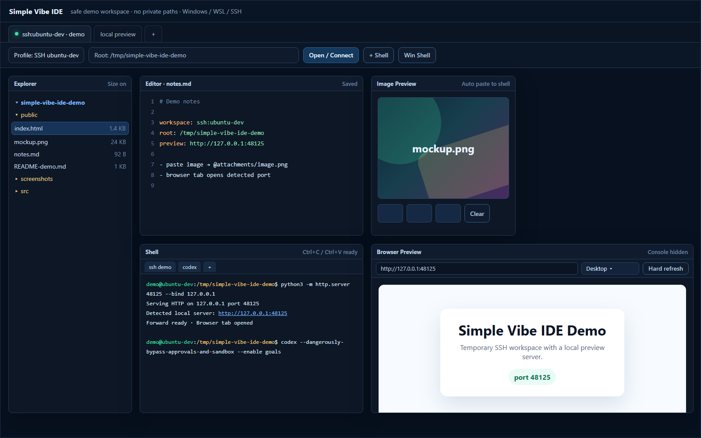

# Simple Vibe IDE

<p>
  <a href="#korean-version">한국어 버전</a> · <a href="#english-version">English version</a>
</p>

<details id="korean-version" open>
<summary><strong>한국어 버전 보기</strong></summary>

## Simple Vibe IDE란?

Simple Vibe IDE는 Windows에서 WSL, SSH, 로컬 Windows shell을 빠르게 오가며 LLM 코딩 세션을 돌리기 위한 Windows 전용 lightweight desktop IDE입니다.

목표는 거창한 범용 IDE가 아니라, 바이브 코딩 중 자주 반복되는 흐름을 빠릿빠릿하게 만드는 것입니다. 작업공간을 열고, shell을 여러 개 띄우고, Codex/Claude/Grok/Antigravity를 바로 실행하고, 이미지나 스크린샷을 붙여넣고, 로컬 서버를 브라우저 탭으로 확인하는 과정을 한 화면 안에서 짧게 이어가도록 설계했습니다.

현재 상태: Windows-only, Tauri v2, pre-1.0, experimental.



위 스크린샷은 임시 SSH 데모 workspace와 localhost preview만 사용했습니다. 개인 경로, secret, 사용자 데이터는 포함하지 않았습니다.

## 주요 기능

- Windows Local, WSL, SSH workspace profile 지원
- 기본 Windows titlebar 없는 frameless UI와 앱 내부 최소화/최대화/닫기 버튼
- 처음 실행 시 빈 workspace로 시작해서 사용자가 명시적으로 폴더/profile을 열기 전에는 아무 것도 열지 않음
- workspace tab 저장/복원: profile, root, panel 위치, 크기, 열린 editor/image/browser/shell context 저장
- 상단 market ticker: Binance USD-M WebSocket 기반 BTC와 NAS100 proxy 표시, custom Binance symbol 1개 추가 가능
- Explorer, Editor, Image Preview, Browser, Terminal widget 이동/리사이즈/스냅 지원
- Terminal widget 내부 shell tab 지원
- workspace별 sticky-note 스타일 Notes 패널, always-on-top pin, tab별 테마, 자동 저장되는 메모 탭
- workspace별 Calculator 위젯과 계산 history
- Codex, Claude, Grok, Antigravity launcher 버튼
- secure env editor: env류 파일을 masked key-value editor로 열고, 새 key 추가 가능
- image paste: workspace temp attachment 폴더에 이미지 저장 후 active shell에 `@...` tag 입력
- image preview history, clear history, image copy/paste
- Explorer drag-in: Windows Explorer에서 파일/폴더를 IDE Explorer로 드롭해서 복사
- Explorer clipboard paste: Windows Explorer에서 `Ctrl+C`한 파일/폴더를 IDE Explorer에서 `Ctrl+V`로 붙여넣기
- Explorer export/drag-out: 선택한 항목을 백그라운드 export한 뒤 Windows Explorer로 끌어내기
- 자동 local/WSL development server 감지와 browser preview tab
- browser desktop/phone/tablet viewport preset, hard refresh, lightweight console pane
- workspace별 capture protection toggle

## 설치 요구사항

개발 실행에 필요합니다.

- Windows 10/11 x64
- Node.js 22 이상
- Windows Rust toolchain via rustup, MSVC toolchain 기준
- Rust/Tauri가 요구할 경우 Visual Studio Build Tools C++ workload

작업 방식에 따라 선택적으로 필요합니다.

- WSL distro
- Windows OpenSSH client
- 실행하려는 LLM CLI: `codex`, `claude`, `grok`, `antigravity`

## 빠른 시작

Windows 로컬 checkout에서 일반적으로는 아래만 실행하면 됩니다.

```powershell
npm install
npm run tauri:dev
```

조금 더 확실히 확인하려면 아래 순서로 실행합니다.

```powershell
npm install
npm run check
npm run build
cd src-tauri
cargo check
cd ..
npm run tauri:dev
```

Tauri dev server는 `127.0.0.1:15320`으로 고정되어 있습니다. Windows reserved port range와 부딪혀 일반적인 dev port가 `listen EACCES`를 내는 상황을 피하기 위해서입니다.

## WSL 안에 있는 checkout을 Windows에서 실행하기

repo가 WSL 안에 있고 Windows Node/Rust/Tauri로 실행해야 한다면, raw UNC 경로에서 바로 실행하기보다 `cmd pushd`로 임시 drive letter를 잡는 편이 안정적입니다. Cargo target은 Windows-local temp 폴더로 분리하세요.

```powershell
$env:Path = "$env:USERPROFILE\.cargo\bin;$env:Path"
$env:CARGO_INCREMENTAL = "0"
$env:CARGO_TARGET_DIR = "$env:TEMP\simple-vibe-ide-target"
cmd /d /s /c 'pushd "\\wsl.localhost\[DISTRO]\home\[USER]\simple-vibe-ide" && npm install && npm run check && npm run build && cd src-tauri && cargo check && cd .. && npm run tauri:dev'
```

`[DISTRO]`, `[USER]`는 본인 환경에 맞게 바꿔서 사용하세요.

같은 WSL UNC checkout을 대상으로 `npm`/Vite/Tauri 명령을 동시에 여러 개 돌리지 않는 것을 권장합니다. 임시 drive mapping이나 path resolution이 꼬일 수 있습니다.

## 빌드와 실행

Windows release build:

```powershell
$env:CARGO_INCREMENTAL = "0"
$env:CARGO_TARGET_DIR = "$env:TEMP\simple-vibe-ide-target"
npm run tauri:build
```

빌드 후 실행:

```powershell
.\run-built.vbs
```

- `run-built.vbs`: 추가 console 창 없이 조용히 실행하는 일반 launcher
- `run-built.cmd`: 디버깅용으로 console 창을 보면서 실행하는 launcher

두 launcher 모두 실행 파일을 Windows-local working directory에서 시작하고 repo root는 별도로 넘깁니다. WSL checkout에서 빌드한 앱이 `wsl.exe` path translation 문제를 내는 것을 줄이기 위한 방식입니다.

## 첫 사용 흐름

1. 앱을 실행합니다. 처음에는 빈 workspace입니다.
2. profile을 선택합니다: Windows Local, WSL, SSH.
3. 작업할 root/working directory를 선택하거나 입력합니다.
4. `Open / Connect`를 누릅니다.
5. Explorer, terminal, editor, image preview, browser preview를 작업공간에 맞게 배치합니다.
6. 필요하면 workspace tab으로 현재 layout/context를 저장해 두고 다시 불러옵니다.

WSL profile은 첫 화면이 먼저 반응 가능해진 뒤 background로 로드됩니다. SSH profile은 Windows OpenSSH config의 literal `Host` alias를 읽어 자동 추가합니다. wildcard host pattern은 자동 추가하지 않습니다.

## 기능 자세히 보기

### Workspace와 layout

- workspace tab은 profile, root, panel 위치/크기, 열린 context를 저장합니다.
- Explorer, Editor, Image Preview, Browser, Terminal widget은 title bar로 이동할 수 있고 grip으로 resize할 수 있습니다.
- 가까운 edge는 자석처럼 붙도록 snap됩니다.
- `Ctrl` + `+`, `Ctrl` + `-`는 포커스된 editor/terminal의 font size를 조절합니다.
- Notes에서는 note font size, Browser에서는 preview zoom, Calculator에서는 계산기 글자 크기를 조절합니다.
- 전체 IDE scale을 바꾸고 싶으면 상단 titlebar 쪽을 focus target으로 둔 상태에서 조절합니다.
- 새 shell widget이나 shell tab은 다른 widget 아래에 묻히지 않도록 앞으로 올라옵니다.
- `+shell`, Windows shell, Codex/Claude/Grok/Antigravity 버튼으로 새 terminal widget을 열 때는 workspace별 마지막 terminal 크기를 기억해서 다시 사용합니다.

### Market ticker

- 상단 toolbar 오른쪽에 BTC와 NAS100 ticker가 표시됩니다.
- NAS100은 Binance USD-M의 `QQQUSDT`를 proxy로 사용합니다.
- 가격과 24시간 등락률은 Binance USD-M Futures WebSocket으로 갱신하고, WebSocket이 끊기면 느린 REST snapshot으로 fallback합니다.
- 추가로 Binance USD-M symbol 1개를 직접 입력해 볼 수 있습니다.
- ticker는 앱 초기화 뒤에 늦게 시작되며, 실패해도 editor, terminal, browser 작업을 막지 않습니다.

### Explorer

- Windows, WSL, SSH workspace를 같은 Explorer UI로 탐색합니다.
- `Use This Folder`로 선택한 폴더를 새 workspace root처럼 다시 열 수 있습니다.
- 폴더는 일반 IDE처럼 root 아래에서 expand/collapse됩니다.
- 새 파일/새 폴더를 inline으로 만들고, `F2`로 inline rename할 수 있습니다.
- 알파벳을 치면 해당 글자로 시작하는 항목이 선택되고, Enter로 열 수 있습니다.
- 마우스 Back 버튼으로 상위 폴더로 이동할 수 있습니다.
- file size column은 켜고 끌 수 있으며, 폭이 좁아지면 자동으로 숨겨지고 긴 파일명은 ellipsis 처리됩니다.
- 이미지 파일은 UTF-8 text로 열지 않고 Image Preview에서 엽니다.
- Windows executable은 가능한 경우 직접 실행합니다. WSL 경로도 Windows path로 변환 가능한 경우 실행됩니다.

### Explorer 파일 가져오기/내보내기

- Windows Explorer에서 파일/폴더를 IDE Explorer 위로 드롭하면 현재 폴더 또는 hovered folder로 복사됩니다.
- 같은 이름이 있으면 덮어쓰지 않고 `name 2.ext` 같은 numbered suffix로 저장합니다.
- Explorer에 포커스가 있을 때 `Ctrl+V`를 누르면 Windows Explorer에서 `Ctrl+C`한 파일/폴더가 현재 Explorer 폴더로 복사됩니다.
- 이미지 파일을 복사해 붙여넣어도 image preview 기능으로 빠지지 않고 파일 복사로 처리됩니다.
- Explorer에 포커스가 있고 clipboard가 순수 이미지라면 현재 폴더에 `image.png`, `image01.png` 식으로 저장합니다.
- `Export` 버튼은 선택한 항목을 Windows temp export folder로 background export합니다.
- export 중에도 editor, terminal, browser, UI 조작은 계속 가능합니다.
- export job은 progress와 cancel을 제공합니다.
- 완료된 export는 `Open`으로 위치를 열거나 `Drag out` 버튼을 Windows Explorer로 끌어낼 수 있습니다.
- SSH file export는 별도 SSH stream으로 내려받고, SSH folder export는 `.tar` archive로 stream export합니다.

### Editor와 secure env editor

- text file은 lightweight CodeMirror editor로 열립니다.
- `Ctrl+S`로 저장할 수 있고 기본 undo/redo 동작을 유지합니다.
- env류 private file은 masked key-value editor로 열립니다.
- 각 row에 reveal button이 있고, raw reveal toggle도 있습니다.
- `.env.example`, sample/example 파일은 기본 masking 대상에서 제외됩니다.
- 기존 값은 masked 상태로 유지하면서 새 env key를 추가할 수 있습니다.

### Terminal과 LLM launcher

- Terminal pane은 Windows, WSL, SSH shell을 PTY로 실행합니다.
- 각 terminal widget은 내부 shell tab을 가집니다.
- terminal text가 선택되어 있을 때 `Ctrl+C`는 copy로 동작하고, 선택이 없을 때는 interrupt로 동작합니다.
- `Ctrl+V`는 clipboard text를 shell에 붙여넣습니다.
- Codex, Claude, Grok, Antigravity 버튼은 새 terminal session을 엽니다.

기본 launcher flag:

- Codex: `--dangerously-bypass-approvals-and-sandbox --enable goals`
- Claude: `--dangerously-skip-permissions`
- Grok: `--permission-mode bypassPermissions`
- Antigravity: 호환되는 local bypass flag가 확인되기 전까지 기본 실행

실행 전에 alias/function/wrapper script를 확인해서 이미 들어간 flag는 다시 붙이지 않습니다. 이 flag들은 의도적으로 approval/permission prompt를 줄이기 위한 것입니다. 더 보수적으로 쓰고 싶다면 일반 terminal에서 직접 CLI를 실행하세요.

### Image Preview

- 앱에 스크린샷이나 image clipboard를 붙여넣으면 현재 workspace의 temp attachment folder에 저장됩니다.
- 첫 이미지는 `image.png`, 이후는 `image01.png`, `image02.png` 식으로 저장됩니다.
- active terminal에는 저장된 attachment의 `@...` tag가 입력됩니다.
- Image Preview는 작은 history를 보여주고 clear history를 지원합니다.
- Image Preview에 포커스가 있을 때 `Ctrl+C`는 현재 preview image를 복사합니다.
- Image Preview에 포커스가 있을 때 `Ctrl+V`는 clipboard image를 새 attachment/history item으로 저장하고 shell에 tag를 붙여넣습니다.
- `Auto paste to shell`은 외부에서 처음 이미지를 가져올 때 active shell에 tag를 자동 입력할지 결정합니다.

### Notes

- Notes 패널은 editor와 별도의 빠른 메모장입니다.
- workspace별로 여러 note tab을 만들 수 있고, 입력 내용은 자동 저장됩니다.
- Pin을 켜면 Notes 패널이 다른 IDE 위젯 위에 고정됩니다.
- 각 note tab은 Default, Sticky, Mint, Rose, Paper 테마를 따로 선택할 수 있습니다.
- 테마 색상은 각 note tab에서 미리 보이고, 선택된 테마는 tab bar 아래 메모 영역에만 적용됩니다.
- 메모는 현재 workspace 아래 `.vibe-ide-temp/notes/*.txt`에 저장됩니다.
- workspace를 다시 열면 열려 있던 note tab과 Notes 패널 상태가 복원됩니다.

### Calculator

- Calculator 패널은 workspace 안에서 빠르게 계산할 수 있는 간단한 계산기입니다.
- 사칙연산, 괄호, `%` 연산을 지원합니다.
- 숫자열과 넘버패드, `Enter`/`NumpadEnter`, `Backspace`, `Delete` 입력을 지원합니다.
- 계산 history는 workspace snapshot에 저장됩니다.
- Calculator에 포커스가 있을 때 `Ctrl` + `+`, `Ctrl` + `-`는 계산기 글자 크기를 조절합니다.

### Browser와 port forwarding

- terminal output에서 `http://localhost:3000` 같은 local server URL을 감지합니다.
- 감지된 server는 Browser tab으로 열 수 있고, WSL profile은 가능한 경우 local forwarding/proxy를 자동 설정합니다.
- Browser URL box에는 full URL 또는 `3000` 같은 port 번호만 입력할 수 있습니다.
- desktop, phone, tablet viewport preset이 device menu에 포함되어 있습니다.
- stale local preview를 위한 hard refresh가 있습니다.
- manual remote/local forwarding은 fallback으로 남아 있습니다.
- WSL/local forwarding은 in-app TCP proxy를 사용하고, SSH forwarding은 `ssh.exe -N -L`을 사용합니다.
- Browser preview는 lightweight preview입니다. full devtools, extension, 복잡한 cross-origin debugging이 필요하면 일반 브라우저를 사용하세요.

### Capture protection

workspace tab의 보안 아이콘으로 capture protection을 켜고 끌 수 있습니다.

켜져 있을 때 앱은 Windows capture-affinity API와 in-app protected overlay를 사용해 특정 workspace가 streaming/screen sharing에 노출되는 것을 줄입니다.

단, 이것은 보조 privacy 기능이지 절대적인 보안 보장은 아닙니다. OBS나 화면 공유 도구는 capture backend가 다양하고 동작이 다를 수 있으므로, 실제 송출 환경에서 반드시 먼저 테스트하세요.

## 안전과 개인정보 주의사항

- 이 프로젝트는 Windows-only, pre-1.0 experimental local tool입니다.
- LLM launcher는 알려진 범위에서 approval/sandbox bypass flag를 기본 사용합니다. CLI가 명령 실행 전 확인을 덜 할 수 있습니다.
- secure env editor는 UI에서 값을 mask하지만 파일 자체를 암호화하지 않습니다.
- 붙여넣은 이미지는 workspace temp attachment folder에 저장됩니다. 해당 폴더는 기본적으로 gitignore 대상입니다.
- private env file, credential, token, screenshot, attachment, workspace temp output을 public repo에 커밋하지 마세요.
- capture protection은 best-effort입니다. 실제 OBS/화면 공유 방식에서 동작을 확인하세요.

## 문제 해결

### `npm run dev` 또는 Tauri dev가 `listen EACCES`로 실패함

개발 포트는 `127.0.0.1:15320`으로 고정되어 있습니다. 그래도 다른 process가 이 포트를 쓰고 있다면 `vite.config.ts`와 Tauri config의 dev URL을 함께 바꾸세요.

### WSL UNC checkout에서 build가 느리거나 path resolution이 깨짐

위의 WSL checkout 명령처럼 `cmd pushd`와 Windows-local `CARGO_TARGET_DIR`를 사용하세요. raw UNC working directory에서 Windows tool을 직접 돌리면 npm, Vite, Cargo, Tauri가 서로 다른 방식으로 path 문제를 낼 수 있습니다.

### built app에서 `wsl.exe` path translation 오류가 보임

빌드 후 `run-built.vbs`로 실행하세요. executable은 Windows-local working directory에서 시작하고 repo root는 별도로 전달합니다.

### LLM 버튼을 눌렀는데 command not found가 나옴

해당 CLI를 설치하고 선택한 profile의 PATH에서 보이도록 설정하세요. Windows, WSL, SSH는 각각 PATH가 다릅니다.

### SSH profile이 안 보임

Windows OpenSSH config의 literal `Host` alias만 자동 import됩니다. wildcard entry는 무시됩니다.

### local server를 껐는데 Browser preview에 화면이 남아 있음

정적 페이지나 iframe cache 때문에 남아 보일 수 있습니다. hard refresh를 누르거나 해당 port를 새 tab으로 다시 열어보세요.

## 현재 제한사항

- WSL UNC checkout은 reliable Windows dev build를 위해 polling watch, `pushd`/mapped-drive 실행, Windows-local Cargo target directory가 필요할 수 있습니다.
- SSH file operation은 POSIX remote와 `sh`, `find`, `cat`, `base64`, `tar` 등 기본 도구를 가정합니다.
- 큰 remote image preview는 Tauri command channel을 거치므로 local/WSL보다 느릴 수 있습니다.
- workspace restore는 UI/context를 복원하지만 오래 실행 중이던 shell process 자체를 snapshot으로 되살리지는 않습니다.
- Drag out은 WebView2가 `DownloadURL`/`file://` drag data를 받는 방식에 의존합니다. 동작하지 않는 환경에서는 `Open` 버튼이 fallback입니다.
- Capture protection은 Windows와 capture backend에 따라 결과가 다릅니다.
- 아직 signed installer나 stable release channel은 없습니다.

## 프로젝트 구조

- `src/`: TypeScript UI
- `src-tauri/`: Rust backend와 Tauri config
- `public/`: capture cover 같은 static WebView asset
- `docs/`: README용 안전한 demo screenshot
- `run-built.vbs`, `run-built.cmd`: 빌드된 앱 실행 helper
- `codex.md`: privacy-safe implementation notes와 patch notes

## License

아직 license를 선택하지 않았습니다.

</details>

<details id="english-version">
<summary><strong>View English Version</strong></summary>

## What Is Simple Vibe IDE?

Simple Vibe IDE is a Windows-only lightweight desktop IDE for LLM-heavy coding sessions across Windows local shells, WSL, and SSH.

It is not trying to be a full general-purpose IDE. The goal is a fast practical loop for vibe coding: open a workspace, split shells, launch Codex/Claude/Grok/Antigravity, paste screenshots, preview local servers, and keep that working state close at hand.

Status: Windows-only, Tauri v2, pre-1.0, experimental.


The screenshot uses a disposable SSH demo workspace and localhost preview. It does not contain private paths, secrets, or user data.

## Highlights

- Windows Local, WSL, and SSH workspace profiles
- Frameless window with in-app minimize, maximize/restore, and close controls
- Empty first launch until the user explicitly opens a local, WSL, or SSH workspace
- Workspace tabs that restore profile, root, panel positions, sizes, and open context
- Top market ticker for BTC and a NAS100 proxy via Binance USD-M WebSocket, plus one custom Binance symbol
- Movable, resizable, snapping Explorer, Editor, Image Preview, Browser, and Terminal widgets
- Shell tabs inside each terminal widget
- Workspace-level sticky-note style Notes panel with always-on-top pinning, per-tab themes, and autosaved note tabs
- Workspace-level Calculator widget with calculation history
- Launcher buttons for Codex, Claude, Grok, and Antigravity
- Secure env editor for masked env-style files, including adding new keys while values stay masked
- Image paste into workspace-local temp attachments, with `@...` tags inserted into the active shell
- Image preview history, clear history, image copy/paste
- Explorer drag-in from Windows Explorer into the IDE
- Explorer clipboard paste from Windows Explorer into the active workspace
- Explorer async export and drag-out to Windows Explorer
- Automatic local/WSL development server detection and browser preview tabs
- Browser desktop/phone/tablet viewport presets, hard refresh, and lightweight console pane
- Workspace-level capture protection toggle

## Requirements

Required for development:

- Windows 10/11 x64
- Node.js 22 or newer
- Rust for Windows via rustup using the MSVC toolchain
- Visual Studio Build Tools with the C++ workload if Rust or Tauri asks for it

Optional depending on your workflow:

- One or more WSL distros
- Windows OpenSSH client
- LLM CLIs you want to launch: `codex`, `claude`, `grok`, or `antigravity`

## Quick Start

For a normal Windows-local checkout:

```powershell
npm install
npm run tauri:dev
```

For a fuller pre-flight check:

```powershell
npm install
npm run check
npm run build
cd src-tauri
cargo check
cd ..
npm run tauri:dev
```

The Tauri dev server is pinned to `127.0.0.1:15320` to avoid Windows reserved-port conflicts that can make common dev ports fail with `listen EACCES`.

## Running A WSL Checkout From Windows

If the repo lives inside WSL and you are running Windows Node/Rust/Tauri tools against it, use `cmd pushd` so Windows gets a temporary drive letter. Keep Cargo output on a Windows-local filesystem.

```powershell
$env:Path = "$env:USERPROFILE\.cargo\bin;$env:Path"
$env:CARGO_INCREMENTAL = "0"
$env:CARGO_TARGET_DIR = "$env:TEMP\simple-vibe-ide-target"
cmd /d /s /c 'pushd "\\wsl.localhost\[DISTRO]\home\[USER]\simple-vibe-ide" && npm install && npm run check && npm run build && cd src-tauri && cargo check && cd .. && npm run tauri:dev'
```

Replace `[DISTRO]` and `[USER]` with placeholders for your own environment before running the command.

Avoid running multiple npm/Vite/Tauri commands in parallel against the same WSL UNC checkout. Temporary drive mapping and path resolution can race.

## Build And Launch

Windows release build:

```powershell
$env:CARGO_INCREMENTAL = "0"
$env:CARGO_TARGET_DIR = "$env:TEMP\simple-vibe-ide-target"
npm run tauri:build
```

After building:

```powershell
.\run-built.vbs
```

- `run-built.vbs`: normal quiet launcher without an extra console window
- `run-built.cmd`: debug launcher with a visible console window

Both helpers start the executable from a Windows-local working directory and pass the repo root separately. That reduces `wsl.exe` path translation problems when the app was built from a WSL checkout.

## First Run

1. Start the app. It opens with an empty workspace.
2. Choose a profile: Windows Local, WSL, or SSH.
3. Select or type the working directory.
4. Click `Open / Connect`.
5. Arrange Explorer, terminal, editor, image preview, and browser preview for the workspace.
6. Use workspace tabs when you want to save and return to that layout/context quickly.

WSL profiles are loaded in the background after the first screen is interactive. SSH profiles are auto-created from literal `Host` aliases in your Windows OpenSSH config. Wildcard host patterns are ignored.

## Feature Tour

### Workspaces And Layout

- Workspace tabs save and restore profile, root, panel positions, sizes, and open context.
- Explorer, Editor, Image Preview, Browser, and Terminal widgets can be moved by their title bars and resized from their grips.
- Nearby edges snap to each other.
- `Ctrl` + `+` and `Ctrl` + `-` resize the focused editor or terminal font.
- In Notes they resize note text, in Browser they change preview zoom, and in Calculator they resize calculator text.
- To scale the whole IDE, focus the top titlebar area first.
- New shell widgets and shell tabs are brought to the front automatically.
- New terminal widgets opened from `+shell`, Windows shell, or Codex/Claude/Grok/Antigravity buttons reuse the last terminal size saved for that workspace.

### Market Ticker

- The top toolbar shows BTC and NAS100 tickers on the right.
- NAS100 uses Binance USD-M `QQQUSDT` as a proxy.
- Price and 24h change update through Binance USD-M Futures WebSocket, with a slow REST snapshot fallback when the socket drops.
- You can add one extra Binance USD-M symbol manually.
- The ticker starts after the app shell is interactive and does not block editor, terminal, or browser work if it fails.

### Explorer

- Browse Windows, WSL, or SSH workspaces from one Explorer UI.
- Use `Use This Folder` to reopen the workspace from a selected folder.
- Folders expand and collapse under the selected root like a typical IDE tree.
- Create files/folders inline and rename with `F2`.
- Type letters to select matching entries, then press Enter to open.
- Use the mouse Back button to move to the parent folder.
- Toggle file sizes on/off. Narrow widths hide sizes automatically and truncate long names with ellipses.
- Image files open in Image Preview instead of being decoded as UTF-8 text.
- Windows executables can be launched directly, including translated WSL paths when possible.

### Explorer File Import And Export

- Drag files or folders from Windows Explorer into the IDE Explorer to copy them into the current folder or the hovered folder row.
- Existing names are not overwritten. Duplicate names get a numbered suffix such as `name 2.ext`.
- When Explorer has focus, `Ctrl+V` pastes files/folders copied from Windows Explorer into the current Explorer folder.
- Copied image files remain file operations and do not fall through to the image preview workflow.
- If Explorer has focus and the clipboard contains a raw image instead of a file path, the image is saved as `image.png`, `image01.png`, and so on in the current folder.
- The `Export` button exports the selected item to a Windows temp export folder in the background.
- The editor, terminal, browser, and UI remain responsive during export.
- Export jobs show progress and support cancellation.
- Completed exports provide `Open` and `Drag out` actions.
- SSH file exports stream through a separate SSH process. SSH folder exports are streamed as `.tar` archives.

### Editor And Secure Env Files

- Text files open in a lightweight CodeMirror editor.
- `Ctrl+S` saves, and standard editor undo/redo behavior is preserved.
- Private env-style files open in a masked key-value editor.
- Each row has a reveal button, and there is a raw reveal toggle.
- `.env.example`, sample, and example files are excluded from default masking.
- New env keys can be added while existing values stay masked.

### Terminals And LLM Launchers

- Terminal panes use PTYs for Windows, WSL, and SSH shells.
- Each terminal widget has its own shell tabs.
- `Ctrl+C` copies selected terminal text; with no selection, it sends interrupt.
- `Ctrl+V` pastes clipboard text into the shell.
- Codex, Claude, Grok, and Antigravity buttons open new terminal sessions.

Default launcher flags:

- Codex: `--dangerously-bypass-approvals-and-sandbox --enable goals`
- Claude: `--dangerously-skip-permissions`
- Grok: `--permission-mode bypassPermissions`
- Antigravity: launches normally until a compatible local bypass flag is known

Before launching, the app checks aliases, functions, and wrapper scripts, then skips flags that are already present. These flags intentionally reduce approval/permission prompts. If you want the normal prompts, launch the CLI manually in a terminal instead.

### Image Preview

- Paste screenshots or image clipboard data into the app to save attachments under the current workspace temp attachment folder.
- The first image is saved as `image.png`, then `image01.png`, `image02.png`, and so on.
- The active terminal receives an `@...` tag for the saved attachment.
- Image Preview keeps a small history and supports clear history.
- When Image Preview is focused, `Ctrl+C` copies the current preview image.
- When Image Preview is focused, `Ctrl+V` saves the clipboard image as a new attachment/history item and pastes its tag into the shell.
- `Auto paste to shell` controls whether externally imported images automatically paste their tags into the active shell.

### Notes

- The Notes panel is a quick scratchpad separate from the code editor.
- Each workspace can have multiple note tabs, and note text autosaves while you type.
- Pin keeps the Notes panel above other IDE widgets.
- Each note tab can use its own Default, Sticky, Mint, Rose, or Paper theme.
- Theme colors are previewed on each note tab, while the selected theme only applies below the tab bar.
- Notes are stored as `.vibe-ide-temp/notes/*.txt` inside the current workspace.
- Reopening a workspace restores open note tabs and the Notes panel state.

### Calculator

- The Calculator panel is a small in-workspace calculator for quick arithmetic.
- It supports basic arithmetic, parentheses, and `%`.
- It accepts the number row, numpad keys, `Enter`/`NumpadEnter`, `Backspace`, and `Delete`.
- Calculation history is stored with the workspace snapshot.
- When Calculator is focused, `Ctrl` + `+` and `Ctrl` + `-` resize calculator text.

### Browser And Port Forwarding

- Terminal output is scanned for local server URLs such as `http://localhost:3000`.
- Detected servers can be opened in Browser tabs, and WSL profiles get automatic local forwarding where possible.
- The Browser URL box accepts a full URL or just a port number like `3000`.
- Desktop, phone, and tablet viewport presets are included in the device menu.
- Hard refresh is available for stale local previews.
- Manual remote/local forwarding remains available as a fallback.
- WSL/local forwarding uses an in-app TCP proxy. SSH forwarding uses `ssh.exe -N -L`.
- Browser Preview is intentionally lightweight. Use a full browser when you need full devtools, extensions, or complex cross-origin debugging.

### Capture Protection

Workspace tabs include a capture-protection control.

When enabled, the app uses Windows capture-affinity APIs and an in-app protected overlay to reduce exposure of selected workspace content during streaming or screen sharing.

This is a privacy aid, not a guarantee. OBS and screen-sharing tools have multiple capture backends and can behave differently. Test your exact streaming setup before relying on it live.

## Safety And Privacy Notes

- This project is a Windows-only pre-1.0 experimental local tool.
- LLM launcher buttons use approval/sandbox bypass flags where known. The launched CLI may run actions with fewer confirmations.
- The secure env editor masks values in the UI, but it does not encrypt files on disk.
- Pasted images are stored under the workspace temp attachment folder, which is ignored by default.
- Do not commit private env files, credentials, tokens, screenshots, attachments, or workspace temp output to public repositories.
- Capture protection is best-effort and should be tested with your actual OBS or screen-sharing mode.

## Troubleshooting

### `npm run dev` or Tauri dev fails with `listen EACCES`

The dev port is pinned to `127.0.0.1:15320`. If another process already uses that port, update both `vite.config.ts` and the Tauri dev URL together.

### WSL UNC builds feel slow or path resolution breaks

Use the WSL checkout command above with `cmd pushd` and a Windows-local `CARGO_TARGET_DIR`. Raw UNC working directories can confuse npm, Vite, Cargo, and Tauri in different ways.

### The built app shows `wsl.exe` path translation errors

Launch through `run-built.vbs` after building. It starts the executable from a Windows-local working directory and passes the repo root separately.

### LLM buttons open a terminal but the command is not found

Install the matching CLI and make sure it is available on PATH for the selected profile. Windows, WSL, and SSH shells each have separate PATH environments.

### SSH profile is missing

Only literal `Host` aliases from your Windows OpenSSH config are auto-imported. Wildcard entries are ignored.

### Browser preview still shows a stopped local server

Static pages and iframe cache can remain visible. Use hard refresh or open the port in a new browser tab.

## Current Limitations

- WSL UNC checkouts may need polling file watching, `pushd`/mapped-drive command execution, and a Windows-local Cargo target directory for reliable Windows dev builds.
- SSH file operations assume a POSIX remote with common tools such as `sh`, `find`, `cat`, `base64`, and `tar`.
- Large remote image previews pass through the Tauri command channel, so they may feel slower than local Windows/WSL previews.
- Restored workspaces save UI/work context, but long-running shell processes are recreated rather than resumed from process snapshots.
- Drag out depends on WebView2 accepting `DownloadURL`/`file://` drag data. Use `Open` as the fallback when needed.
- Capture protection depends on Windows and the capture backend used by the streaming or screen-sharing tool.
- There is no signed installer or stable release channel yet.

## Project Layout

- `src/`: TypeScript UI
- `src-tauri/`: Rust backend and Tauri configuration
- `public/`: static WebView assets such as the capture cover
- `docs/`: safe demo screenshot for README
- `run-built.vbs`, `run-built.cmd`: helpers for launching built artifacts
- `codex.md`: privacy-safe implementation notes and patch notes

## License

No license has been selected yet.

</details>
